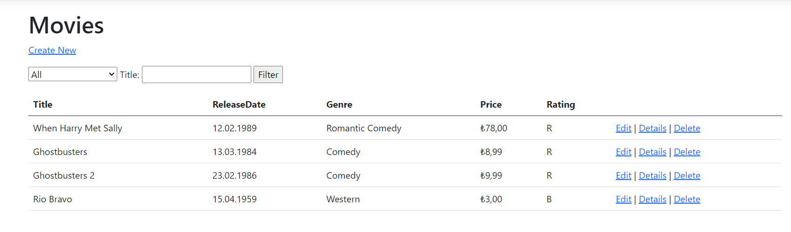

# ASP.NET Core Razor Page Tutorial (.NET 7.0)

This repository contains a project developed as part of a tutorial on Microsoft's official site for learning ASP.NET Core Razor Pages. The purpose of this project is to help developers understand the fundamentals of building web applications using Razor Pages in ASP.NET Core.



## Project Overview

- **Tutorial Source**: [Microsoft ASP.NET Core Razor Pages Tutorial](https://docs.microsoft.com/en-us/aspnet/core/tutorials/razor-pages/)
- **Technologies Used**:
  - ASP.NET Core
  - Razor Pages
  - Entity Framework Core (for data access)
  - Bootstrap (for styling)
- **Features Implemented**:
  - Basic CRUD operations (Create, Read, Update, Delete)
  - Form validation
  - Database integration with Entity Framework Core

## How to Run the Project

1. **Clone the repository**:
    ```bash
    git clone https://github.com/samedbilgili/aspnetcore-razorpage-crud-movie.git
    cd aspnetcore-razorpage-crud-movie
    ```

2. **Install dependencies**:
    Make sure you have the .NET SDK installed. You can download it from [here](https://dotnet.microsoft.com/download).
    ```bash
    dotnet restore
    ```

3. **Set up the database**:
    Update the connection string in `appsettings.json` to point to your database. Then, run the following command to apply migrations:
    ```bash
    dotnet ef database update
    ```

4. **Run the application**:
    ```bash
    dotnet run
    ```

5. **Access the application**:
    Open your browser and navigate to `https://localhost:5001` (or the URL provided in the terminal).

## Contribution

Feel free to open issues or submit pull requests if you have suggestions for improvements or find any bugs.

## License

This project is licensed under the MIT License. See the [LICENSE](LICENSE) file for more details.
